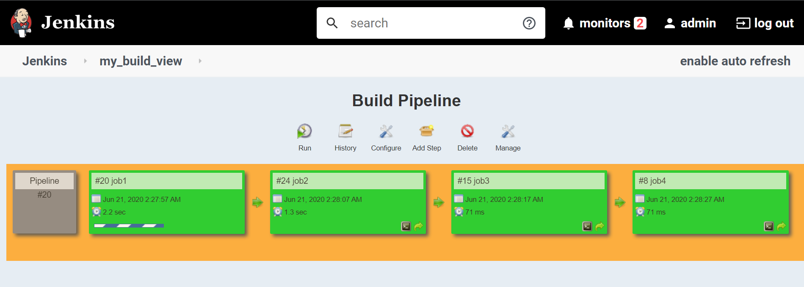
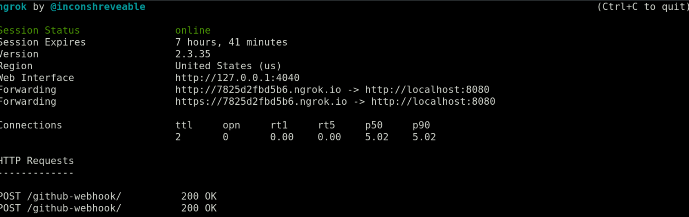
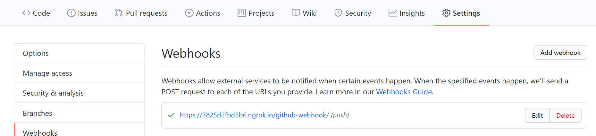
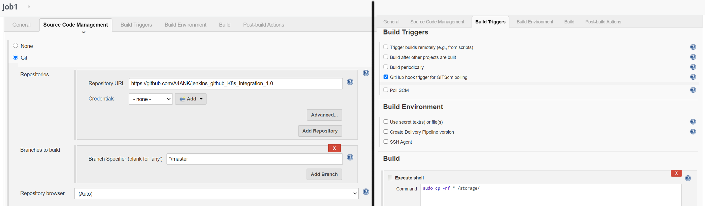
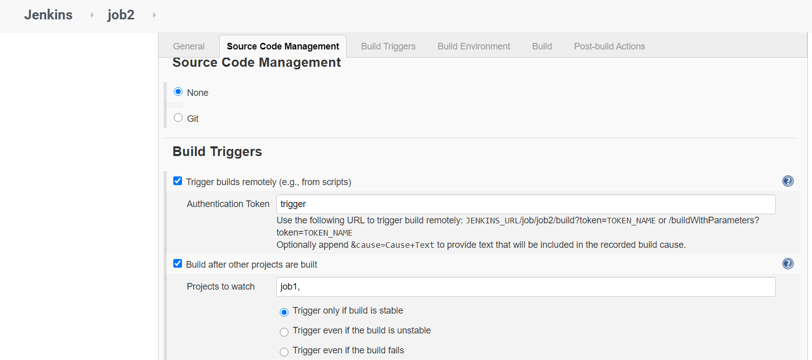
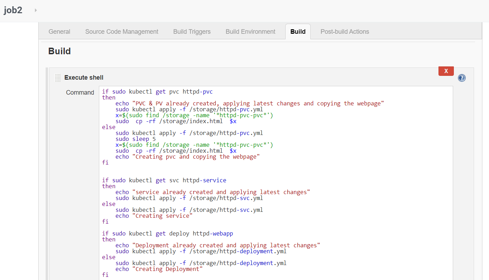
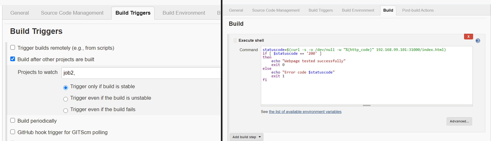
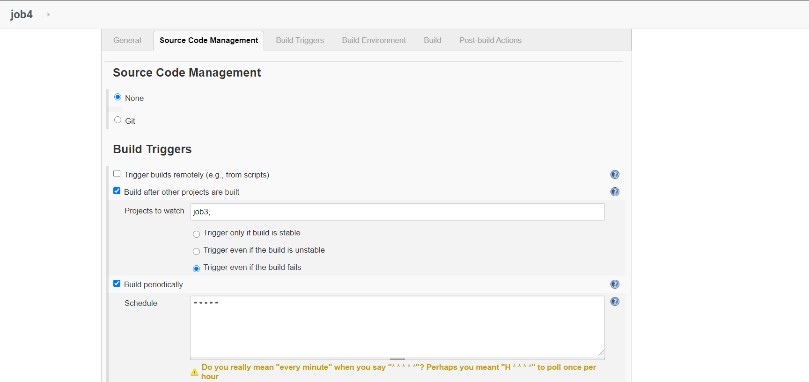
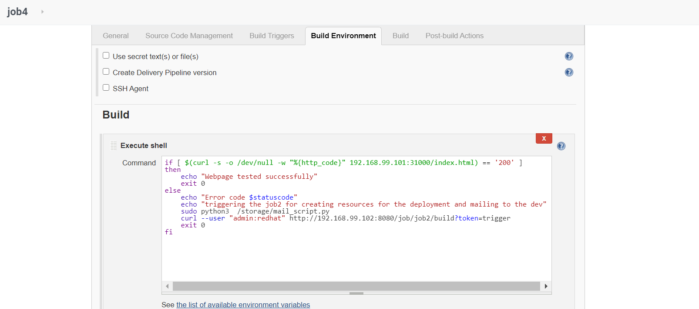

# Integration of Kubernetes(using NFS-server & 3rd party NFS-client Dynamic provisioning) with Jenkins and Github.
## To create resources like Pods, Deployment, PVC and Service, etc on the top of K8s.

Tasks to be created:-
1. Create container image that’s has Jenkins installed using Dockerfile Or You can use the Jenkins Server on RHEL 8/7
2. When we launch this image, it should automatically starts Jenkins service in the container.
3. Create a job chain of job1, job2, job3 and job4 using build pipeline plugin in Jenkins
4. Job1: Pull the Github repo automatically when some developers push repo to Github.
5. Job2:
   1. create a persistent volume claim.
   2. create service for the application.
   3. create a deployment for the application.
6. Job3: Test your app if it is working or not.
7. Job4: If an app is not working then trigger job 2 and then send email to the developer with error messages and then when the developer will do necessary changes in the code then redeploy the application.


## Prerequisites:- 
A pre-installed K8s cluster(e.g. minikube). In minikube by default, there is no internal NFS dynamic provisioner is available for the storage class so it can claim a PVC or PV dynamically. so we are creating a NFS-client dynamic provisioner in the K8s cluster using a service account, cluster roles, etc., which basically uses RBAC (role-based access controls) Authorization.
[configure service accounts](https://kubernetes.io/docs/tasks/configure-pod-container/configure-service-account/)
[role based access controls](https://kubernetes.io/docs/reference/access-authn-authz/rbac/)

*Creating this part of the task is very easy in the Openshift Container Platform.
Also, install Github, Build Pipeline Plugin in Jenkins.

```
[root@server ~]# mkdir /storage
[root@server ~]# chmod 0777 -R /storage
[root@server ~]# ls -ahl / | grep storage
drwxrwxrwx.   4 root root 4.0K Jun 21 02:28 storage

[root@server ~]# cat /etc/exports
/storage *(rw,no_root_squash)

[root@server ~]# exportfs -rv
exporting *:/storage

[root@server ~]# showmount -e 192.168.99.102

[root@server ~]# kubectl get clusterrole,role | grep nfs 

[root@server ~]# kubectl apply -f rbac-nfs-dynamic-provisioner.yml
serviceaccount/nfs-dynamic-provisioner created
clusterrole.rbac.authorization.k8s.io/nfs-dynamic-provisioner-clusterRole created
clusterrolebinding.rbac.authorization.k8s.io/nfs-dynamic-provisioner-rolebinding created
role.rbac.authorization.k8s.io/nfs-dynamic-provisioner-otherRoles created
rolebinding.rbac.authorization.k8s.io/nfs-dynamic-provisioner-otherRoles created

[root@server ~]# kubectl get clusterrole,role | grep nfs
clusterrole.rbac.authorization.k8s.io/nfs-dynamic-provisioner-clusterRole                                    2020-06-20T17:27:36Z
role.rbac.authorization.k8s.io/nfs-dynamic-provisioner-otherRoles   2020-06-20T17:27:36Z

[root@server ~]# kubectl apply -f nfs-storage-class.yml
storageclass.storage.k8s.io/nfs-storageclass created

[root@server ~]# kubectl get sc
NAME                 PROVISIONER                RECLAIMPOLICY   VOLUMEBINDINGMODE   ALLOWVOLUMEEXPANSION   AGE
nfs-storageclass     nfs-storageclass           Delete          Immediate           false                  37h
standard (default)   k8s.io/minikube-hostpath   Delete          Immediate           false                  39d

[root@server ~]# kubectl apply -f  nfs-client-pod-dynamic-provisioner.yml
deployment.apps/nfs-client-pod-dynamic-provisioner created

[root@server ~]# kubectl get pods
NAME                                                  READY   STATUS    RESTARTS   AGE
nfs-client-pod-dynamic-provisioner-684557596c-x4z6v   1/1     Running   0          9m28s

[root@server ~]# kubectl describe pods nfs-client-pod-dynamic-provisioner-684557596c-x4z6v | grep Volumes -A 5
Volumes:
  nfs-provisioner-volume:
    Type:      NFS (an NFS mount that lasts the lifetime of a pod)
    Server:    192.168.99.102
    Path:      /storage
    ReadOnly:  false
```

We also need to configure a kubeconfig file in the home directory of root user since we are running kubectl command using sudo.

```
[root@server ~]# kubectl config view
apiVersion: v1
clusters:
- cluster:
    certificate-authority: /root/ca.crt
    server: https://192.168.99.101:8443
  name: mycluster
contexts:
- context:
    cluster: mycluster
    user: jen
  name: mycontext
current-context: mycontext
kind: Config
preferences: {}
users:
- name: jen
  user:
    client-certificate: /root/client.crt
    client-key: /root/client.key
```

Now we can start doing our tasks and jobs using Jenkins.
# Job1
Pull the Github repo automatically when some developers push repo to Github.




# Job2
   1. create a persistent volume claim.
   2. create service for the application.
   3. create a deployment for the application.



# Job3
Test your app if it is working or not.


# Job4
If an app is not working then trigger job 2 and then send email to the developer with error messages and then when the developer will do necessary changes in the code then redeploy the application.




P.S.- Any questions or suggestions are welcome.
All the scripts and configuration files are present at the GitHub repo.
https://github.com/A4ANK/jenkins_github_K8s_integration_1.0

  
